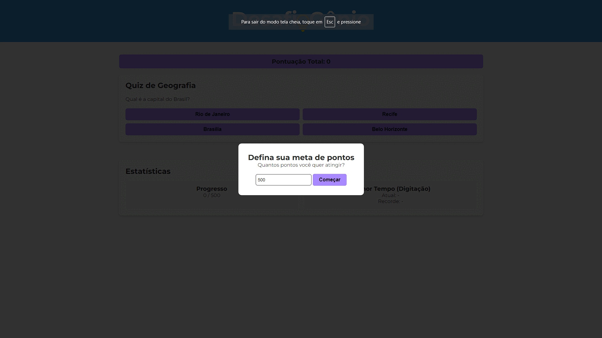

<div align="center">
  
</div>
<div align="center"><br><br>
  
  
  
</div><br>

## 📋 Sobre o Projeto
Desafio Gênio é uma plataforma educacional gamificada que combina aprendizado e diversão através de 6 diferentes atividades interativas. O projeto foi desenvolvido com o objetivo de tornar o processo de aprendizagem mais envolvente e eficaz.
<br><br>

## 🎯 Atividades Disponíveis

### 🌎 Quiz de Geografia
- Explore diferentes lugares e culturas.
- Aprenda sobre países, capitais e características geográficas.

### 📚 Quiz de História
- Teste seus conhecimentos históricos.
- Aprenda sobre eventos importantes de forma divertida.

### 🧩 Quebra-Cabeça
- Desenvolva raciocínio lógico.
- Melhore suas habilidades de resolução de problemas.

### 🔤 Palavra Embaralhada
- Expanda seu vocabulário.
- Pratique reconhecimento de palavras.

### 🔢 Matemática
- Pratique operações matemáticas.
- Desenvolva agilidade com números.

### ⌨️ Quiz de Digitação
- Melhore sua velocidade de digitação.
- Aprenda técnicas de digitação corretas.
<br><br>

## 🚀 Como Executar
1. Clone este repositório:
```
git clone https://github.com/devluiizz/desafioGenio.git
```

<br>

2. Navegue até o diretório do projeto:
```
cd desafioGenio
```

<br><br>
## 📸 Screenshots
<div align="center">
  
</div>
<br><br>

## 📄 Licença
Este projeto está sob a licença MIT. Veja o arquivo LICENSE para mais detalhes.
